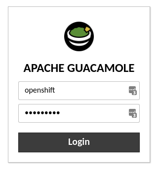
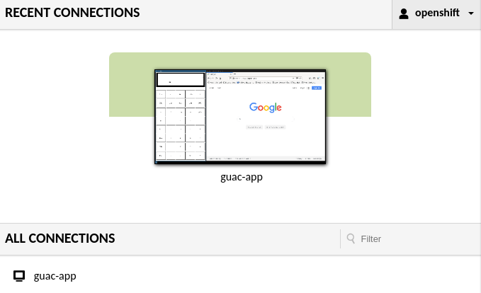
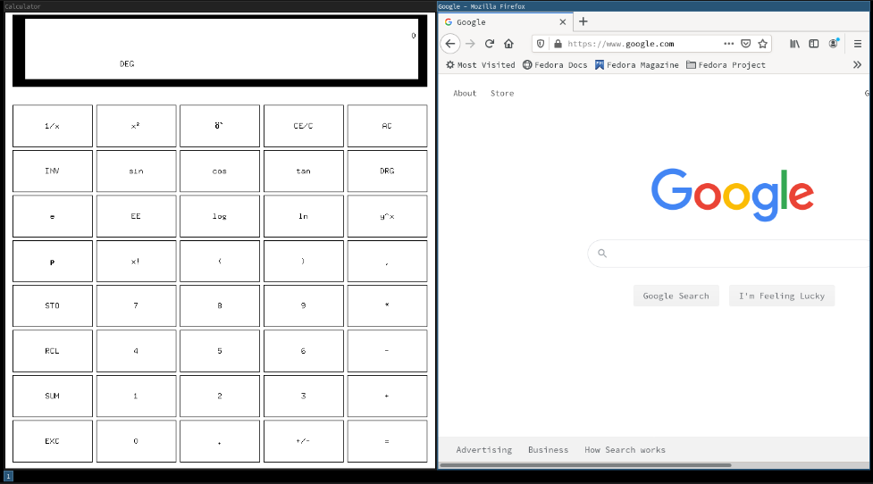

# Guacamole on OCP Demo

This demo will deploy guacamole containerized on OpenShift along with a containerized i3 window manager running xcalc and firefox side-by-side. The demo can be deployed using the deploy.sh script. Log into an OpenShift cluster (tested on 4.4) and execute this script on a linux command line.

This is based off of Rich Lucente's [blog](https://www.openshift.com/blog/put-ide-container-guacamole) and [git repository](https://github.com/rlucente-se-jboss/jbds-via-html5/blob/master/resources/start.sh).

# The Demo
After everything is deployed via deploy.sh, the script will print the url and login credentials (openshift / openshift) for getting into guacamole

After logging in, you will see a priview of the apps (xcalc and firefox) running containerized.

Click the preview to interact with the applications in the container.

The windows are running in the [i3 tiling window manager](https://i3wm.org/) so that windows are automatically arranged. To manipulate the windows, [familiarize yourself with i3](https://i3wm.org/docs/refcard.html). The i3 **mod** key is set to **Alt**

## Limitations / TODOs
The VNC connection would frequently crash if tls was enabled (which it is by default). Disabled tls for the purposes of this demo. The [mtls-demo subfolder describes how to use istio to enable mutual tls](mtls-demo) to get around this issue.

Currently the application pod is running fedora.
